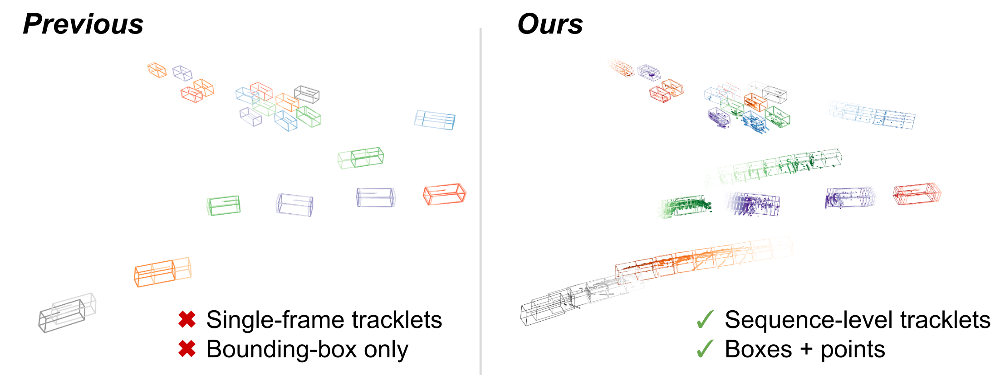

# SpOT: Spatiotemporal Modeling for 3D Object Tracking

This is the official implementation for the ECCV 2022 oral presentation [SpOT](https://arxiv.org/pdf/2207.05856.pdf).




#### **CURRENTLY BEING UPDATED. PLEASE BE PATIENT.**

## Quick Installation

#### Python Environment
> Note: the code in this repo has been tested on Ubuntu 20.04 with Python 3.8, CUDA 11.1, and PyTorch 1.9.0. It may work for other setups, but has not been tested.

For quick installation, install [anaconda](https://www.anaconda.com/) and run `bash setup.sh ANACONDA_PATH ENV_NAME`. For example,
`bash setup.sh /home/colton/anaconda3 spot_env`. For step-by-step installation, see below.

Note that we use [Weights and Biases](https://wandb.ai/) for visualizations and run metrics. In order to access any program outputs, please create a Weights and Biases account.

#### Waymo Open Dataset Evaluation
The Waymo Open Dataset uses a separate evaluation pipeline that must be compiled with [Bazel](https://bazel.build/). In order to evaluate on Waymo, clone the [waymo toolkit](https://bazel.build/) into `third_party/` and follow the repo instructions to compile all Bazel scripts. Place the compiled tracking-evaluation script at:
`./third_party/waymo-open-dataset/bazel-bin/waymo_open_dataset/metrics/tools/compute_tracking_metrics_main`


## Downloads
#### Preprocessed Datasets
We provide preprocessed versions of the nuScenes and Waymo datasets. Note that these datasets are quite large. To download them run:
* `cd data`
* `bash download_data.sh`

In case of slow download speeds, we additionally provide the data at [this google drive link](https://drive.google.com/drive/folders/196g1VK7kZLbabk0RYp1_2Qd6C14nS4Wr?usp=sharing)

#### Pretrained Weights
We provide downloads for pretrained models of SpOT. To download them, visit this [link](https://drive.google.com/drive/folders/1S7r7vR43GzDVRLXnK9RVleV2YbMMzDKp?usp=sharing).

#### nuScenes Dataset
> Note: the nuScenes dataset must be downloaded for any nuScenes tracking evaluation

Please refer to the official [nuScenes website](https://www.nuscenes.org/). To verify reported results in the paper, download the **full dataset (v1.0)** for both **trainval** and **test** splits. To additionally run our preprocessing, also download the **nuScenes-lidarseg** annotations. Simlink the dataset folder to `./data/nuScenes`.

#### Waymo Open Dataset
> Note: the Waymo Open dataset only needs to be downloaded if you do NOT wish to use our preprocessed format (i.e. you want to preprocess the dataset from scratch).

Please refer to the official [Waymo website](https://waymo.com/open/data/perception/). To verify reported results in the paper, download the **Perception Dataset v1.2**. Follow the structure of the GCP bucket, i.e. the base folder contains `training`, `validation`, and `testing`, each with many `.tfrecord` files. Simlink the dataset folder to `./data/Waymo`.

## Evaluation with Pretrained Models
The [`spot/test.py`] script is used to run the evaluations on a trained SpOT model. Here are examples running various evaluations with the provided pretrained network weights.

#### nuScenes Dataset
To reproduce nuScenes results on the `cars` class run:
```
python spot/test.py --config=configs/reported_eval/nusc_reported_car.yaml --general.out=./out/nusc_car
```

To reproduce nuScenes results on the `pedestrian` class run:
```
python spot/test.py --config=configs/reported_eval/nusc_reported_pedestrian.yaml --general.out=../out/nusc_ped
```

#### Waymo Dataset
To reproduce nuScenes results on the `vehicles` class run:
```
python spot/test.py --config=configs/reported_eval/waymo_reported_vehicle.yaml --general.out=../out/waymo_vehicle
```

To reproduce nuScenes results on the `vehicles` class run:
```
python spot/test.py --config=configs/reported_eval/waymo_reported_pedestrian.yaml --general.out=../out/waymo_ped
```


## Training
Coming soon...

## Installation Step by Step
Coming soon...

## Data Preprocessing
We suggest using the provided preprocessed datasets under the <b>Downloads</b> section. Still, this section will explain how to preprocess data from the official nuScenes and Waymo datasets. Because the nuScenes and Waymo datasets are large, and our preprocessing extracts all single-object sequences, expect preprocessing to take at least 24 hours per dataset.

> Note: although our preprocessing requires previous methods' tracking submissions to generate training sequences, we do NOT use information from previous tracking methods in evaluation.

#### nuScenes Dataset


We preprocess the official [nuScenes dataset](https://www.nuscenes.org/) as follows:
* Download off-the-shelf detections from your backbone of choosing. In our paper, we use [detections from CenterPoint](https://github.com/tianweiy/CenterPoint/issues/249#issuecomment-1015891599).

* Run an existing tracking pipeline on the detections to generate an [official nuScenes tracking submission](https://www.nuscenes.org/tracking?externalData=all&mapData=all&modalities=Any). The submission file will be a `.json`. In our paper, we use [CenterPoint tracking](https://github.com/tianweiy/CenterPoint/tree/master/tools/nusc_tracking).
  *  We provide our reproduced CenterPoint tracking submissions [here](https://drive.google.com/drive/folders/1kXUL8oxDaHZPUV0_rCLYc8s9pIMXYO9u).
  *  Make sure the tracking method does NOT modify, add, or remove any detections for the <b>validation</b> or <b>test</b> splits!

* Create preprocessed object sequences from the tracking submission:
  ```
  python preprocessing/nuscenes/preprocess.py --data-path "./data/nuScenes" --version "<one of [v1.0-trainval, v1.0-test]" --split "<one of [train, val, test]>" --save-dir "./data/nuScenes-preprocessed" --track-results-path "<path-to-tracking-submission>"
  ```
   * Note that nuScenes preprocessing requires the **nuScenes-lidarseg** annotations under the ./data/nuScenes folder
   * nuScenes preprocessing will take ~2 hours for the val/test splits, and ~12 hours for the train split.


#### Waymo Open Dataset
We preprocess the official [Waymo Open Datasset](https://waymo.com/open/data/perception/) as follows:
* Download off-the-shelf detections from your backbone of choosing. In our paper, we use [detections from CenterPoint](https://github.com/tianweiy/CenterPoint). Please email the CenterPoint authors to obtain their detections.

* Run an existing tracking pipeline on the detections to generate an [official Waymo tracking submission](https://waymo.com/open/challenges/2020/3d-tracking/). The submission file will be a `.bin` protobuf file. In our paper, we use [CenterPoint tracking](https://github.com/tianweiy/CenterPoint/tree/master/tools/waymo_tracking).
  * Upon verifying permission to use CenterPoint detections on the Waymo dataset (obtain permission from the authors), we will share our reproduced CenterPoint tracking submissions.
  * Make sure the tracking method does NOT modify, add, or remove any detections for the validation split! For CenterPoint tracking, this means setting `--score_thresh=0.0` for this split. 
  * The Waymo training split often outputs tracking results that exceed the 2GB protobuf file limit. To circumvent this, split the results into multiple protobuf files within a single directory.
  
* Preprocessed the object sequences:
  ```
  python preprocessing/waymo/preprocess.py --load_dir "./data/Waymo/<one of [training, validation]>" --split "<one of [train, val, test]>" --save-dir "./data/Waymo-preprocessed" --results_file "<path-to-bin-tracking-submission>"
  ```
   * Waymo preprocessing will take ~8 hours for the val/test splits, and ~48 hours for the train split.


## Citation
If you found this code or paper useful, please consider citing:
```
@inproceedings{stearns2022spot,
	author={Stearns, Colton and Rempe, Davis and Li, Jie and Ambrus, Rares and Guizilini, Vitor and Zakharov, Sergey and Yang, Yanchao and Guibas, Leonidas J.},
	title={SpOT: Spatiotemporal Modeling for 3D Object Tracking},
	booktitle={European Conference on Computer Vision (ECCV)},
	year={2022}
}
```

## Questions?
If you run into any problems or have questions, please create an issue or contact Colton (`coltongs@stanford.edu`).